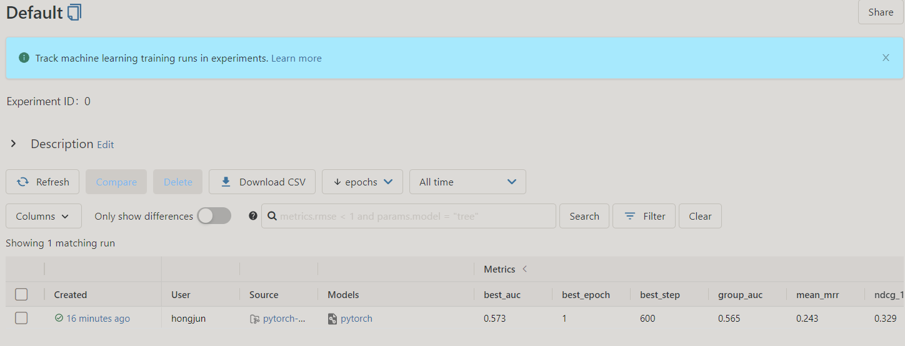

# PyTorch implementation for news recommendation algorithms

For practice, I tried to implement the news recommendation algorithms in the [recommenders] with PyTorch


## Implemented Algorithms
- [NPA] (Wu et al., 2019, SIGKDD) [1]
- [NRMS] (Wu et al., 2019, IJCNLP) [2]
- [Fastformer] (Wu et al., 2021, arxiv) [3]


## Dataset
Take it easy, do not download the dataset first, We will automatically download the dataset in `train.py`
- [MIND]: the description about MIND dataset can refer to [this document](https://github.com/msnews/msnews.github.io/blob/master/assets/doc/introduction.md)

## Environment
- OS: Ubuntu 18.04
- Python == 3.7.13
- mlflow == 1.29.0

Please follow the setup steps bellow:
1. Install [Anaconda](https://www.anaconda.com/products/distribution)
2. Create a virtual environment by using conda command 
```
$> conda env create -n deepnewsrec python=3.7.13
```
3. Activate the virtual environment we created
```commandline
$> conda activate deepnewsrec
```
4. Install mlflow
```commandline
(deepnewsrec)$> pip install mlflow==1.29.0
```

## How to run the code
- Try a toy example with `demo` dataset 
```commandline 
$> mlflow run -e train --experiment-name individual_runs -P mind_type=demo -P epochs=1 .
```
or you can use git uri
```commandline
$> mlflow run -e train --experiment-name individual_runs -P mind_type=demo -P epochs=1 git@github.com:hongjunyan/pytorch-news-recommendation.git 
```

- Run hyperparameter tuning
```commandline
$> mlflow run -e tune_with_ray --experiment-name tune_hyperparams -P mind_type=demo -P epochs=1 .
```

if you want to train a formal model, please use `mind_type=large`.

## MLFlow UI
The experiment results recorded in `/mlruns`. You can use `mlflow ui` to open a web UI and compare the results on it.
```commandline
$> mlflow ui -h 127.0.0.1
```
then hit http://127.0.0.1:5000



## Results of Formal Model
| Algorithms \ Metrics | AUC        | MRR        | NDCG@5     | NDCG@10    |
|----------------------|------------|------------|------------|------------|
| NPA                  | 0.6655     | 0.3171     | 0.3504     | 0.4143     |
| FastFormer           | 0.6813     | 0.3287     | 0.3633     | 0.4273     |
| NRMS                 | **0.6822** | **0.3307** | **0.3655** | **0.4311** |

## Related projects
- [recommenders]: best practices for building recommendation systems

## Reference papers
- [1] Chuhan Wu, Fangzhao Wu, Mingxiao An, Jianqiang Huang, Yongfeng Huang, and Xing Xie. 2019b. Npa: Neural news recommendation with personalized attention. In KDD, pages 2576–2584. ACM.
- [2] Chuhan Wu, Fangzhao Wu, Suyu Ge, Tao Qi, Yongfeng Huang, and Xing Xie. 2019c. Neural news recommendation with multi-head selfattention. In EMNLP-IJCNLP, pages 6390–6395.
- [3] Chuhan Wu, Fangzhao Wu, Tao Qi, Yongfeng Huang, and Xing Xie. 2021. Fastformer: Additive attention can be all you need. arXiv preprint arXiv:2108.09084(2021)

[recommenders]: https://github.com/microsoft/recommenders/tree/b704c420ee20b67a9d756ddbfdf5c9afd04b576b
[NPA]: https://dl.acm.org/doi/10.1145/3292500.3330665
[NRMS]: https://aclanthology.org/D19-1671.pdf
[MIND]: https://msnews.github.io/
[Fastformer]: https://arxiv.org/pdf/2108.09084.pdf

## TroubleShooting:
- Nan in Tensor (refer to FastSelfAttention in models/fastformer.py): https://discuss.pytorch.org/t/why-i-keep-getting-nan/20383